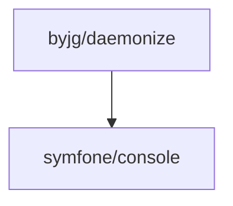

# PHP Daemonize

[](https://github.com/byjg/php-daemonize/actions/workflows/phpunit.yml)
[](http://opensource.byjg.com)
[](https://github.com/byjg/php-daemonize/)
[](https://opensource.byjg.com/opensource/licensing.html)
[](https://github.com/byjg/php-daemonize/releases/)

Transform any class in a *nix daemon process or cron job without changes or refactoring.

## Features

Allow you to do the following without change your pre-existing class:
- Create a *nix daemon process from any PHP class
- Enable call any get RESt endpoint from the shell script
- Enable call any public method from the shell script

## How To:

- [Call a PHP method from command line](docs/script.md)
- [Install a PHP class/method call as a daemon](docs/install.md)
- [Call a GET RESt endpoint from command line](docs/endpoint.md)
- [Show the method documentation](docs/showdocs.md)
- [Environment variables](docs/environment.md)
- [Play with the service](docs/play.md)


## Install

Daemonize does not need to be associated to your PHP project. 

Install locally (preferable):

```bash
composer require "byjg/php-daemonize"
```

Install as a global composer package:

```bash
composer global require "byjg/php-daemonize"
sudo ln -s /root/.composer/vendor/bin/daemonize /usr/local/bin/daemonize

# If you want to share this installation with another users consider use the command `chmod a+x /root`. 
# The root directory will remain unreadable for them, but you'll can execute the script "daemonize".
```

## Dependencies



----  
[Open source ByJG](http://opensource.byjg.com)